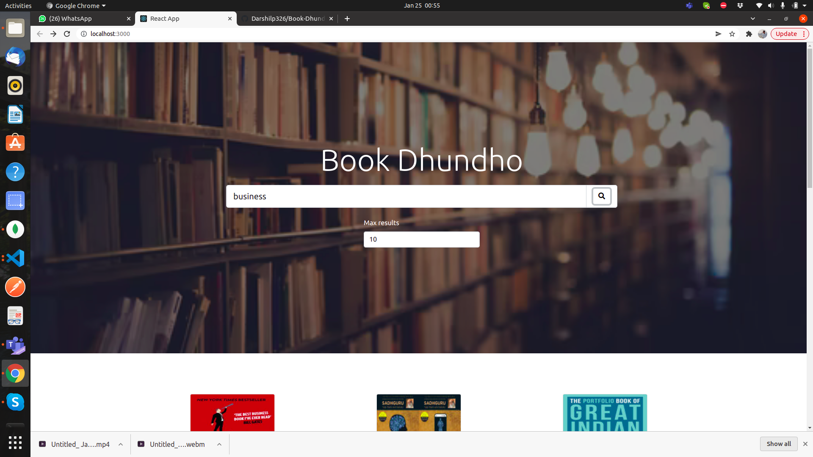
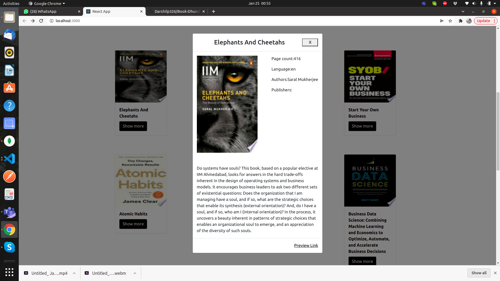
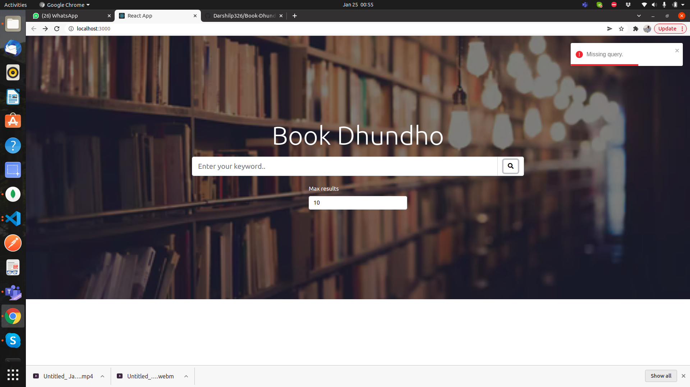

# Setup

- Clone the repo
- Then install npm modules by npm i
- Then write npm start
## Technologies used

- React
- Reactstrap

## Demo Link
https://drive.google.com/file/d/1pZW9VJuur00waq1RyyA7l9y72qHGpbxl/view?usp=sharing
## Screenshots

 
 

 

